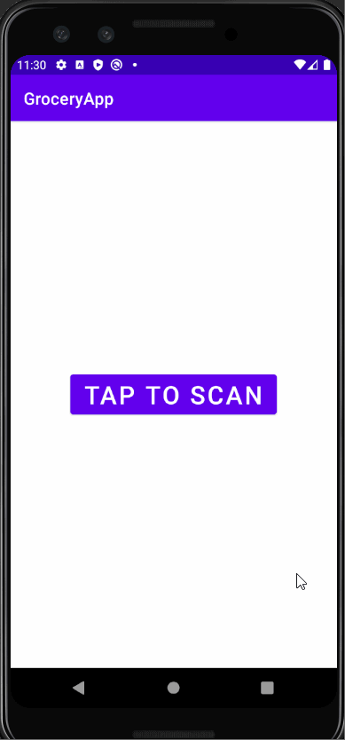
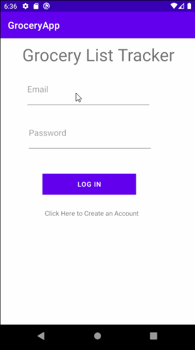
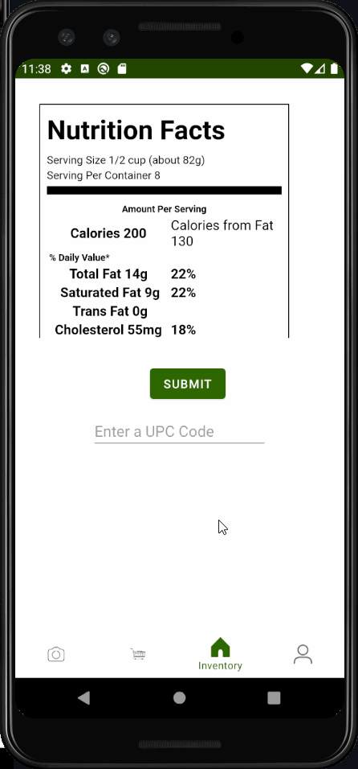

# GroceryList

## Table of Contents
1. [Overview](#Overview)
1. [Product Spec](#Product-Spec)
1. [Wireframes](#Wireframes)
2. [Schema](#Schema)

## Overview
### Description
*GroceryList* is the new, ideal app for keeping track of your stock of groceries at home, as well as keeping track of groceries when supplies run low. Our app allows you to scan the barcode on any grocery item you buy, and keeps an inventory of it in a database. With this database, users can keep track of their stock, as well as form a grocery list of items to buy when supplies run low for certain items.

### App Evaluation
- **Category:** Productivity
- **Mobile:** User can use their phone's camera to scan grocery barcodes
- **Story:** User can easily keep track of their grocery list and inventory
- **Market:** Targeted towards anyone who buys groceries, generally 18+
- **Habit:** User updates the status of what's being consumed whenever they consume groceries, as well as when they buy more food
- **Scope:** Would need to have access to a database of barcodes (Internet connection)

## Product Spec

### 1. User Stories

**Required Must-have Stories**

* [X] Barcode scanner
* [X] Current inventory
* [X] List of groceries you need to buy
* [X] Login + Registration 

**Optional Nice-to-have Stories**

* [X] Grocery budget tracker
* [X] Nutrition Data
* [X] Recommended Products
* [X] Profile
* [X] Friends and Groups
* [X] Social media aspect

### 2. Screen Archetypes

* Scanner
   * Utilizes camera to scan any barcode, sends the barcode to a scraper to retrieve item information, and then adds that item to your inventory
* Inventory
   * Checklist of groceries you currently have
* Grocery list
   * RecyclerView of groceries you want to buy
* Profile
   * User info and settings
* Login Screen
    * User can login to their account
* Registration Screen
    * Create a new account
* The Feed
   * Social Media tab that allows user to see what other grocery items friends have bought

### 3. Navigation

**Tab Navigation** (Tab to Screen)

* Barcode Scanner
* Grocery List
* Inventory
* The Feed
* Profile

**Flow Navigation** (Screen to Screen)

* Login Screen
   * Login to profile
* Registration Screen
   * Create a new account
* Inventory
   * Once you're logged in, you can switch tabs
* Food description
    * Click on a food item to learn more. Ex: bought date, initial size, how often bought

## Initial Wireframe

## Schema
### Models
#### User

   | Property      | Type     | Description |
   | ------------- | -------- | ------------|
   | username      | String   | username for login |
   | password      | String   | password for login |
   | iD            | Int      | Primary key for user |
   | dateOB        | Date     | Birthday date |
   | pic       | Image     | Profile Picture |
   | inventoryList | List<GroceryItem> | List of grocery Objects for inventory |
   | groceryList   | List<GroceryItem> | List of grocery Objects to buy |
   
   
   #### Grocery List

   | Property      | Type     | Description |
   | ------------- | -------- | ------------|
   | item      | int   | foreign key to grocery item |
   | userID            | Int      | used to identify user who created the list |
   | listID            | Int      | primary key for list |
   | itemCount | Int | number of items on the list |
   | createdAt   | Date | date the list was created |
   
   
   #### Grocery Item

   | Property      | Type     | Description |
   | ------------- | -------- | ------------|
   | barcode      | Barcode   | Barcode object, primary key |
   | barcodeType    | BarcodeFormat   | specific type of barcode |
   | quantity            | Int      | how many servings of the item left |
   | dateAdded        | Date     | date the item was added to the list |
   
   
### Networking
* Registration Screen
	* (Create) Create a new account

* Login Screen
	* (Read/GET) Query all user information 

* Inventory Screen
	* (Read/GET) Query inventory list of a user
	* (Update) Update Grocery Items within inventory
 
* Grocery List Screen
	* (Read/GET) Query Grocery list of a user
	* (Update) Update Grocery Items within Grocery List

* Profile Screen 
	* (Read/GET) Query logged in user object
	* (Update/PUT) Update user profile image

### Gif Walkthrough Week 10

### Gif Walkthrough Week 11

### Gif Walkthrough Week 12

### Gif Walkthrough Week 13

### Important Links
	
https://firebase.google.com/ - FireBase Database

https://github.com/zxing/zxing - Barcode Scanner
	
https://jsoup.org/ - Java Web Scraping Library
	
https://weeklycoding.com/mpandroidchart-documentation/ - MPandroidChart (Graphs)

https://www.barcodespider.com/ - Barcode Lookup API
