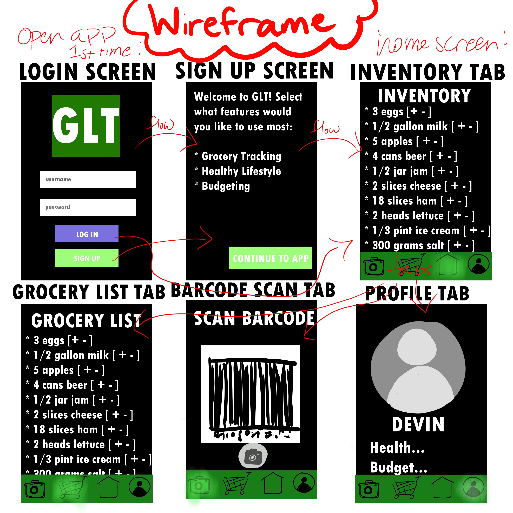

Original App Design Project - README Template
===

# Grocery List Tracker

## Table of Contents
1. [Overview](#Overview)
1. [Product Spec](#Product-Spec)
1. [Wireframes](#Wireframes)
2. [Schema](#Schema)

## Overview
### Description
Allows you to scan bar code of stuff you buy and keeps an inventory of it in a local sqllite db and user can click on the item to 'remove' it whenever it is consumed and when there are none left, alert the user. This can be used to build up a new grocery list automatically so the user has an all in 1 app for grocieries

### App Evaluation
- **Category:** Productivity
- **Mobile:** User can user their phone's camera to scan barcodes.
- **Story:** User can easily keep track of their grocery list
- **Market:** Anyone who buys groceries, generally 18+
- **Habit:** User updates the status of what's being consumed whenever they consume groceries (at least 3 times a day)
- **Scope:** Would need to have access to the inventories of nearby grocery stores? App is pretty clearly defined

## Product Spec

### 1. User Stories (Required and Optional)

**Required Must-have Stories**

* Barcode scanner
* Current inventory
* List of groceries you need to buy

**Optional Nice-to-have Stories**

* Grocery budget
* Healthy foods tracker
* Profile
* Weigh food - package already has weight printed on it
* Social media aspect?
    * 

### 2. Screen Archetypes

* Scanner
   * Get access to camera to scan the barcode of groceries
* Grocery list
   * RecyclerView of groceries you need to buy
* Inventory
   * Checklist of groceries you currently have
* Profile
   * User info, settings
* Login Screen
    * User can login to their account
* Registration Screen
    * Create a new account

### 3. Navigation

**Tab Navigation** (Tab to Screen)

* Scanner
* Grocery List
* Inventory
* Profile

**Flow Navigation** (Screen to Screen)

* Login Screen
   * Login to profile
* Registration Screen
   * Create a new account
* Inventory
   * Once you're logged in, you can switch tabs
* Food description
    * Click on a food item to learn more. Ex: bought date, initial size, how often bought

## Wireframes
[Add picture of your hand sketched wireframes in this section]

## Schema
### Models
#### User

   | Property      | Type     | Description |
   | ------------- | -------- | ------------|
   | username      | String   | username for login |
   | password      | String   | password for login |
   | iD            | Int      | Primary key for user |
   | dateOB        | Date     | Birthday date |
   | pic       | Image     | Profile Picture |
   | inventoryList | List<GroceryItem> | List of grocery Objects for inventory |
   | groceryList   | List<GroceryItem> | List of grocery Objects to buy |
   
   
   #### Grocery List

   | Property      | Type     | Description |
   | ------------- | -------- | ------------|
   | item      | int   | foreign key to grocery item |
   | userID            | Int      | used to identify user who created the list |
   | listID            | Int      | primary key for list |
   | itemCount | Int | number of items on the list |
   | createdAt   | Date | date the list was created |
   
   
   #### Grocery Item

   | Property      | Type     | Description |
   | ------------- | -------- | ------------|
   | barcode      | Barcode   | Barcode object, primary key |
   | barcodeType    | BarcodeFormat   | specific type of barcode |
   | quantity            | Int      | how many servings of the item left |
   | dateAdded        | Date     | date the item was added to the list |
   
   
### Networking
* Registration Screen
	* (Create) Create a new account

* Login Screen
	* (Read/GET) Query all user information 

* Inventory Screen
	* (Read/GET) Query inventory list of a user
	* (Update) Update Grocery Items within inventory
 
* Grocery List Screen
	* (Read/GET) Query Grocery list of a user
	* (Update) Update Grocery Items within Grocery List

* Profile Screen 
	* (Read/GET) Query logged in user object
	* (Update/PUT) Update user profile image
- [OPTIONAL: List endpoints if using existing API such as Yelp]

### Important Links

https://github.com/zxing/zxing

https://developers.google.com/ml-kit/vision/barcode-scanning/android - Google's ML library for scanning barcodes

https://barcodeapi.org/index.html#auto - Barcode Generator

https://www.barcodespider.com/ - Barcode Lookup API

https://jsoup.org/ - Java web scraping library
